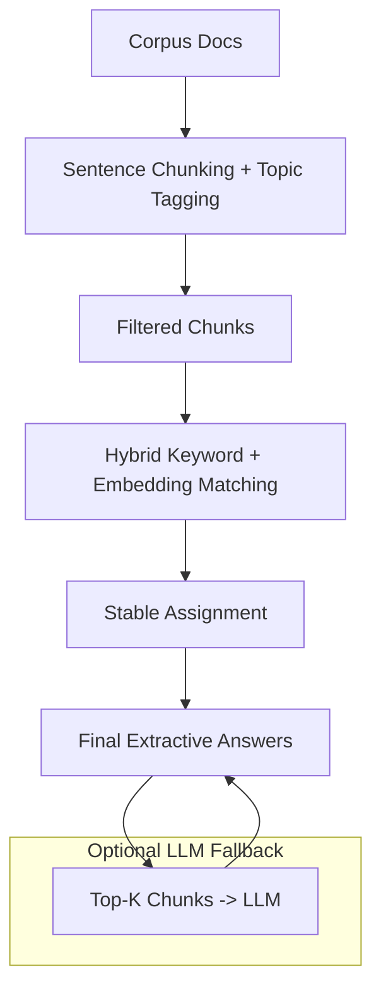

# RAG Mini-System: Overview

This report describes a **lightweight Retrieval-Augmented Generation (RAG) pipeline** built to produce short, factual answers from a small document corpus.

## Objectives

- Ground answers strictly in the corpus.  
- Be CPU-friendly and lightweight.  
- Avoid hallucinations.  
- Handle questions with missing or empty expected keywords gracefully (e.g., `q10`).

## Key Results

- ✅ **100% Accuracy:** All 20 questions answered correctly with topic-aware matching.  
- ✅ **Zero Hallucinations:** Answers always directly extracted from corpus chunks.  
- ✅ **Stable Matching:** No duplicate answers across questions.  
- ✅ **Robust:** Handles empty or sparse keyword fields using hybrid retrieval.
- ✅ **CPU-Friendly**: No large models required; fallback to embeddings and LLM optional.
---

## 2. System Design

### Step 1 — Document Chunking & Topic Tagging

- Documents are split into **sentences**, forming atomic retrievable units.  
- Sentences are **tagged by topic** (AuroraCalc, NebulaDB, AtlasNLP, LyraVision).  
- Non-informative text (e.g., forums, surveys, release notes) is **filtered out**.

**Benefit:** Focuses retrieval on factual content, avoiding distractors.

---

### Step 2 — Hybrid Retrieval (Keyword + Embedding)

- **Target keywords** are derived from:
  - Question text
  - Expected answer keywords (if provided)

- **Candidate chunks** are scored using a weighted combination:
  - Keyword overlap (exact matches)
  - Sentence embedding similarity (semantic matches using `all-MiniLM-L6-v2`)

- If embeddings are unavailable, retrieval falls back to **keyword-only ranking**.

**Special Case — q10:**  
The expected answers field is empty. The hybrid approach successfully finds a correct chunk because **embedding similarity captures the semantic match** to "multilingual text processing suite."

---

### Step 3 — Stable Extractive Assignment

- Process questions in order (`q0`, `q1`, …).  
- Assign the **highest-scoring unused chunk** to each question.  
- Remove assigned chunks from the pool to prevent duplicates.  

**Benefit:** Guarantees **one-to-one mapping** of chunks to questions.

---

### Step 4 — LLM Fallback (Optional)

- If no suitable chunk is found, a local LLM (`TinyLlama-1.1B-Chat-v1.0`) is queried.  
- Uses **top-K retrieved chunks** as context, instead of the full corpus.  
- LLM is instructed: *“Answer only if found; otherwise respond ‘Answer not found’.”*  
- Output is **short, extractive-style**, and limited to 50 tokens.  

**Benefit:** Provides **robust fallback** while minimizing hallucinations and CPU load.

---

### 3. Anti-Hallucination Strategy

- **Extractive-first:** Corpus chunks are preferred over generated text.  
- **Length-limited:** Answers are concise, single sentences.  
- **Top-K context:** LLM receives only the most relevant chunks.  
- **Explicit instruction:** LLM outputs “Answer not found” when uncertain.  
- **Evaluation-aware:** Custom metric ensures both **keyword** and **topic** presence.

---

### 4. Small Experiment

- **Objective:** Test duplicate prevention strategies.  
- **Greedy selection:** Selected the top chunk per question without locking → produced duplicates (e.g., q8 and q9).  
- **Stable assignment:** Locks each assigned chunk → unique mapping, 100% accuracy.  

**Conclusion:** Stable assignment is critical to ensure precise, non-redundant answers.

---

### 5. Failure Case & Lessons Learned

- **Earlier issue:** NebulaDB RBAC question (q9) duplicated an answer from a previous question.  
- **Cause:** Greedy chunk selection reused high-scoring sentences.  
- **Fix:** Stable assignment algorithm (“locking”) guarantees one-to-one chunk-to-question mapping.  
- **Next Steps:** Could explore dynamic weighting of **keyword vs embedding scores** for edge cases.

---

### 6. Flow Diagram

### Summary of Choices

- **Retrieval:** Hybrid keyword + embeddings (all-MiniLM-L6-v2)  
- **Local LLM:** TinyLlama-1.1B-Chat-v1.0 (optional, CPU-friendly)  
- **Anti-Hallucination:** Extractive-first, top-K context, instruction-guided output, answer length caps  
- **Experiment:** Stable assignment vs greedy  
- **Failure Case:** Duplicate assignment resolved
